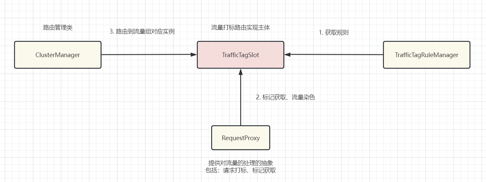

# Issue

以下是关于Sentinel 2.0的全链路灰度的实现方案。


### 目标

Sentinel 2.0 将升级为流量治理组件，提供流量路由、流量调度等更多服务治理体系。本次提案将基于 [issues3023](https://github.com/alibaba/Sentinel/issues/3023) 的流量路由模型, 通过实现流量染色，机器打标以及同一流量组的流量进行路由来实现全链路灰度的功能。

下面是sentinel将支持的流量行为：

- 实例：sentinel客户端节点，会隶属于一个流量组
- 流量组：一个标记所对应的一组实例
- 流量染色：为同一流量透传标记

首先sentinel的客户端实例会隶属与不同的标记组，流量由网关节点进入，在此时网关节点就会对流量进行染色。然后根据用户所配置的流量组，来对不同标记的流量路由分发到相应的流量组内。此外还将提供fallback机制，若是某一流量组，缺少必要节点服务节点，若用户有配置fallback节点便会优先路由至fallback节点，最差情况下也会流向最稳定的服务节点保证链路调用的完整性.


### 如何实现

基于Sentinel1.0 责任链模式实现流控的基础上，

- Core模块：
  - 新增Slot拓展对全链路灰度的支持
  - 流量组配置加载

- Adapter模块：新增对Dubbo，Spring Cloud等的接入SDK；
- Exetension模块：先会支持opensergo获取流量组规则

实现主体：



**以下是几点关键点：**

#### 流量染色

通过opentelemetry所提供的链路追踪SDK来实现对不同的类型的流量进行添加baggage，以达到标记透传的目的

[埋点Demo]: https://github.com/open-telemetry/opentelemetry-java/discussions/4801

#### 流量组与实例

流量组的配置基于Sentinel现有的动态加载配置实现，将流量组核心配置与CRD的关联：

```yaml
# 服务A 稳定环境
# 版本标签
version: v1
# 元数据
metadata: 
	name: service-A
# 标签
label: dev
# 服务节点
container: 
	pod:
		host: 168.12.182.11
		port: 8848
	pod:
		host: 128.182.168.10
		port: 8848
# 服务B 稳定环境
# 版本标签
version: v1
metadata: 
	name: service-A
label: base
container: 
	pod:
		host: 168.12.182.50
		port: 8848
	pod:
		host: 182.182.168.50
		port: 8848
# 服务C 稳定环境
# 版本标签
version: v1
metadata: 
	name: service-C
label: base
container: 
	pod:
		host: 168.12.182.12
		port: 8844
	pod:
		host: 128.182.168.13
		port: 8844
---
# 服务A 灰度环境
# 版本标签
version: v1
kind: dev
metadata: 
	name: service-A
	# fallback 节点选择
	fallback: base
label: dev
container: 
	pod:
		host: 10.12.182.11
		port: 8848
	pod:
		host: 70.182.168.10
		port: 8848
# 服务C 灰度环境
# 版本标签
version: v1
kind: dev
metadata: 
	name: service-C
label: dev
container: 
	pod:
		host: 10.12.182.12
		port: 8844
	pod:
		host: 70.182.168.13
		port: 8844
```

