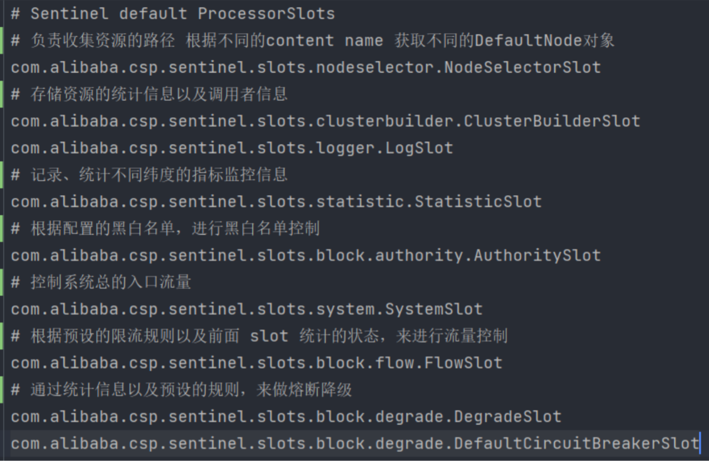

# 项目申请书

项目名称：***Sentinel 2.0 全链路灰度实现与规范对接***

项目主导师：***Robert Lu***

申请人：***林俊洛***

日期：***2023.05.26***

邮箱：**linjunluo2001@163.com**


## 背景

[Sentinel](https://sentinelguard.io/zh-cn/) 是阿里巴巴开源的，面向云原生、分布式服务架构的高可用治理组件，主要以流量为切入点，从流控、流量整形、并发控制、熔断降级、系统自适应保护、热点防护等多个维度来帮助开发者保障微服务的稳定性。Sentinel 2.0 将升级为流量治理组件，提供流量路由、流量调度等更多服务治理体系。

本次任务的目标就是是的Sentinel 2.0 支持全链路灰度，并以 Spring Cloud、Dubbo、Dubbo-go 等 Java/Go 微服务框架为例，为其他框架提供全链路灰度接入SDK和示例。


**目标：详述各组件的作用，流量的走向**


## Sentinel 如何对流量进行监控处理的

我将讲述一遍Sentinel 2.0 目前是对流量进行监控处理的，以便更好的讲述提案。

Sentinel 基于责任链模式，实现了一整个链路处理流量的方法，流量统一从一个`SphU#entry`入口进入，经过`CtSph#lookProcessChain`加载Slot处理链，这里的`Slot`就是得流量监控管理的能力实现载体。


- `SphU`: 用于记录统计数据和执行资源规则检查的基本Sentinel API。流量都是从这个入口进去，且包装为一个个资源`Node`区别资源是使用`ResourceWrapper`包装器来快速区分资源。
- `CtSph`:  `Sph`的实现，负责检查`Content`、通过`lookProcessChain(resourceWrapper)`加载功能插槽链并调用`entry()`执行。
- `ProcessorSlot`:  资源检查或者规则监控的能力实现容器，通过被调用`entry`，`fireEntry`调用后续容器处理检查。
- `XXRuleManager`: 支持指定控制规则的获取和添加`Listener`动态加载`SentinelProperity`的规则。
- `SentinelProperty`: 负责在更新配置时通知在此基础上添加的所有`Listener`。

Sentinel是通过SPI机制加载默认的SlotChain：




## 提案

全链路灰度功能目前我的初步实现方式是通过添加一个RouteSlot来做流量的打标和筛选。

### 筛选路由

目前最新的Sentinel 2.0 已经实现了流量路由模型及数据流设计，详见**https://github.com/alibaba/Sentinel/issues/3023**。

我的后续实现：在流量到达当前节点是时，通过流量到达当前实例节点时，通过`clusterManager#route`实现流量的路由。那么在进行路由前必然是需要对当前到达节点流量进行`tag判断`，检查是否符合放行规则。

### 如何进行流量的打标

#### 问题和解决方案

- 如何存储流量标记组和实例的对应关系？
- 打标的形式是什么？
- 如何进行打标即打标的时机和处理方式？


#### 如何存储流量标记组和实例的对应关系

这里我打算通过一个`TagManager`来管理节点对应的可通过的流量tag组。

- 通过一个Map\<Tag, List\<Instance> > 存储tag对应的实例。对应数据类型还待进一步确定。
- `TagManager`负责管理和动态加载标记组
- Tag 的加载解析基于SentinelProperty和Listener结合动态监听实现，格式参考Istio的灰度流量路由配置格式


#### 打标的形式是什么

- 对机器打标， 配置链路机器组
- 在流量初次路由到sentinel监控的节点时，对流量进行染色
- 经染色的流量只会走向同一标记的链路组
- 不论是http还是rpc都是通过在请求头上添加固定的一个header标识是流量被哪个标记染色


#### 如何进行打标即打标的时机和处理方式

如何区分请求的类型 HTTP or RPC ? `ResourceWrapper#resouceType` 

- 针对HTTP请求，`RequestOriginParse`接口提供了获取源http请求的API定义, 将通过实现此接口或者在获取对应Adapter内实现
- 针对RPC请求，同样也有类似的API可以进行请求的拦截处理，`ServerInterceptor`、`ClientInterceptor`, 可以利用Dubbo Adapter的实现进行拓展操作。

打标的能力对象为`TrafficTagChecker`，其实现对流量的tag检查和染色


上图为主要处理流程图：

- `TrafficTagChecker`通过`TrafficTagRuleManager` 获取tag对应实例表，实例表是后面进行染色和routeCheck的主要依据
- `RequestProxy` 主要处理实现针对Http和RPC不同实现类的header处理，提供一个统一的代理实现
- 通过`checkHasMarked()`判断当前流量是否需要染色还是进行规则检查
- 最后再通过`clusterManager#route`来进行流量的路由，有一点要注意的是，调用时机应该是在Slot的`fireEntry`之后

> 核心概念和k8s crd关联
>
> 有人提过issue 和 pr
>
> 配置怎么样的方式来存储 yml
>
> java / golang 多语言一致

实现思路；目标 - 如何做

先跑起来一个demo 基础上完善 - 搭demo过程中定义好接口

### 新增功能

通过以上设计实现，sentinel 2.0 全链路灰度将支持：

- 流量的染色及路由，保证从Getaway进来的流量能够在一个特定的调用路径中流动
- 流量组规则的配置实现，实现热更新流量组


## 规划

### 项目研发第一阶段（07 月 01 日 - 08 月 15 日）：

- [ ] 完成机器路由组配置加载管理
- [ ] 新增流量染色实现
- [ ] 实现对路由的后续支持，现有数据流实现参考：https://github.com/alibaba/Sentinel/issues/3023
- [ ] 为他框架提供全链路灰度接入SDK和示例
  - [ ] 待确认目前需要对哪些提供支持
- [ ] 完善 OpenSergo 全链路灰度规范


### 项目研发第二阶段（08 月 16 日 - 09 月 30 日）：

- [ ] 解决在中期验收阶段中发现的问题 
- [ ] 对第一阶段完成的内容进行更详细的测试 
- [ ] 对第一阶段的完成内容进行总结，并输出相关文档内容 
- [ ] 对可以改进或者补充的地方进一步完善


## 最后

感谢你的阅读。以上是我对 `sentinel 2.0` 全链路灰度的 proposal。如果有哪些场景没有考虑到或者设计上存在问题，希望你能给我留言。我期待着收到你的宝贵建议，非常感谢！


## NEW

核心概念：

流量组：在不考虑托底机制的情况下, 同一标签流量只会在标签对应流量组内流动。

> 参考opensergo 流量路由标准

核心CRD如下：

```
     - route:
        - destination:
            host: service-provider
            subset: v2
            fallback:
              host: service-provider
              subset: v1
    - route:
        - destination:
            host: service-provider
            subset: v1
```

host 为主机（可以同时设置多个，通过`,`分隔？instance）

subset是对应的组标记，也即是tagRule的tag

fallback是种提供给用户的可选的托底流量组，若是没填，按默认的多级托底机制执行（basic -> ...）


实现主体关系：


### 关于多种方式透传

opentelemetry的实现方式，通过propagator


但目前opentelemetry也是只实现了http grpc fetch等。简单来说就是通过Span往上下文添加propagator等附加信息来实现链路追踪

### Baggage 用法

Baggage 可以在整个链路传播，适用于全局埋点，比如用户id埋点、用户名埋点，以便追踪业务数据。

gateway方法 set Baggage

```java
// Baggage 用法,此处set
	Baggage.current().toBuilder().put("app.username", "gateway").build().makeCurrent();
	logger.info("gateway set baggage[app.username] value: gateway");
```

resource 方法 get Baggage

```java
// Baggage 用法,此get
	String baggage = Baggage.current().getEntryValue("app.username");
	logger.info("resource get baggage[app.username] value: {}", baggage);
```

